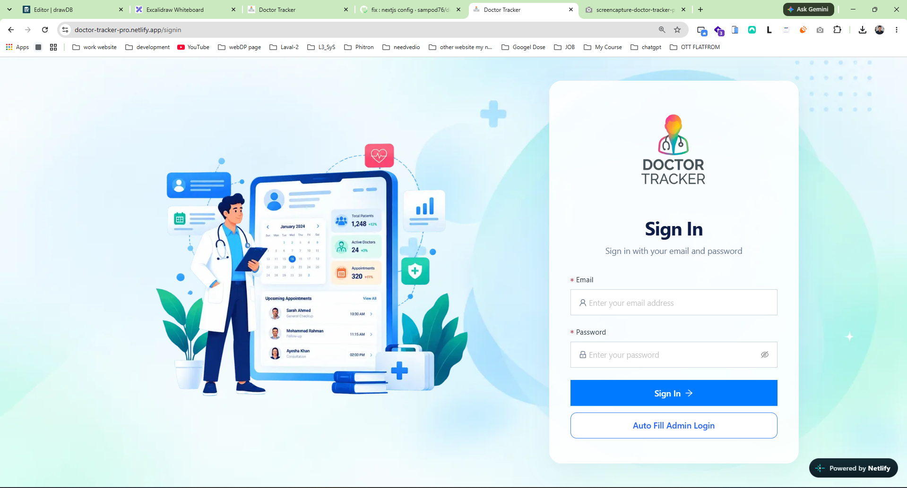
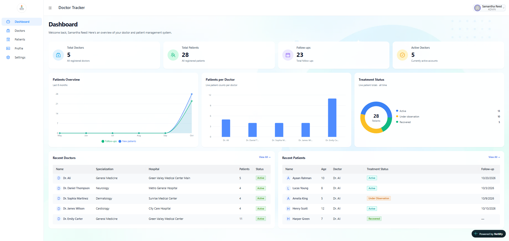
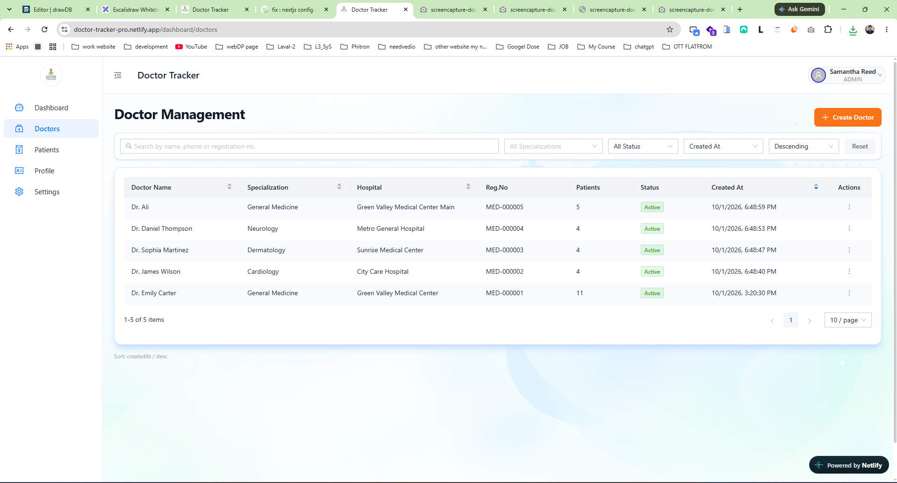
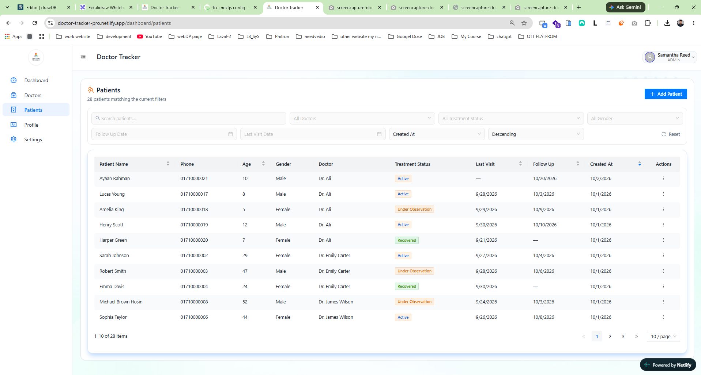

# Doctor Tracker – Frontend

## Project Overview

Doctor Tracker is a doctor and patient management application. This frontend gives authenticated admin users a responsive interface to manage doctor profiles, patient records, treatment status, and follow-up dates, with dashboard analytics and visualizations supplied by the backend API.

## Live Application

- Frontend: [doctor-tracker.iblossomlearn.org](https://doctor-tracker.iblossomlearn.org)
- Alternate frontend: [doctor-tracker-pro.netlify.app](https://doctor-tracker-pro.netlify.app/)

The original frontend URL is preserved from the previous README. The sign-in page redirects to the alternate frontend if login fails on the original domain.

## Demo Credentials

The sign-in page exposes these demo credentials through **Auto Fill Admin Login**:

- Email: `admin@doctortracker.com`
- Password: `Admin@12345`

Authentication requires the backend to have the corresponding account available.

## Key Features

- Email/password sign-in, persisted sessions, automatic token refresh, and client-side dashboard route protection.
- Dashboard totals, recent records, and charts for patient trends, patients per doctor, and treatment status.
- Create, view, edit, and delete doctors; manage specialization, hospital, registration number, and active status.
- Create, view, edit, and delete patients; assign doctors and record complaints, advice, notes, treatment status, and visit/follow-up dates.
- Debounced search, API-driven filtering, sorting, and pagination for doctors and patients.
- Doctor details with a patient list scoped to that doctor, account profile viewing, and password changes.
- Responsive navigation and mobile filter drawers, loading states, retry actions, error boundaries, and 404 pages.

## Tech Stack

- **Framework:** Next.js 14 App Router, React 18, TypeScript.
- **State and API:** Redux Toolkit, RTK Query, React Redux, Redux Persist.
- **UI:** Ant Design, Ant Design Icons, Tailwind CSS.
- **Charts and validation:** Recharts, Ant Design Forms, Zod, Day.js.
- **Tooling:** pnpm, ESLint, Prettier.

## Project Structure

```text
src/
├── app/          # Pages, layouts, and route states
├── components/   # Doctor, patient, dashboard, and shared UI
├── config/       # API host and image configuration
├── constants/    # Navigation and hospital options
├── hooks/        # Authentication, debounce, and mobile helpers
├── redux/        # Store and feature API modules
├── schema/       # Password validation
├── styles/       # Global styles
├── types/        # Data and API types
└── utils/        # API error messages
public/           # Images and fonts
docs/screenshots/ # Existing desktop screenshots
```

## State Management and Data Fetching

Redux Toolkit stores authentication state, persisted to browser local storage with Redux Persist. RTK Query handles API requests, caching, loading/error states, and cache invalidation through separate auth, doctor, patient, and dashboard modules. The shared base query attaches bearer tokens and coordinates refresh attempts after authenticated requests return `401`.

## Setup Guide

Use Node.js and pnpm; the Docker build uses Node.js 22.18.0 and pnpm 10.19.0. A running compatible [backend](https://github.com/sampod76/doctor-tracker-server.git) is required for authentication and application data.

```sh
git clone https://github.com/sampod76/doctor-tracking-dashboard.git
cd doctor_tracking_dashboard
pnpm install
```

Copy `.env.example` to `.env.local`:

```sh
cp .env.example .env.local
```

On PowerShell, use `Copy-Item .env.example .env.local` instead. Set `NEXT_PUBLIC_BASE_URL` to your backend origin, then start the frontend:

```sh
pnpm dev
```

Open [localhost:3000](http://localhost:3000).

| Command                                | Purpose                                 |
| -------------------------------------- | --------------------------------------- |
| `pnpm build`                           | Create the production build             |
| `pnpm start`                           | Serve the production build on port 3000 |
| `pnpm lint`                            | Run ESLint                              |
| `pnpm exec prettier --check README.md` | Check README formatting                 |

The `dev:secure` script references `server.ts`, which is absent from this repository.

## Environment Variables

A safe template is provided in [`.env.example`](./.env.example).

```dotenv
NEXT_PUBLIC_BASE_URL=
```

Set this to the backend origin without `/api/v1`; the API client appends that prefix. If unset, the frontend uses the API host defined in `src/config/index.ts`. Next.js embeds `NEXT_PUBLIC_*` values at build time, so configure the host before building and keep secrets out of these variables. The template also sets `NODE_ENV=development`; the Next.js scripts select the environment for their respective modes.

## System Architecture

The frontend renders the interface and calls the backend REST API through RTK Query. The architecture image is maintained in the [backend repository](https://github.com/sampod76/doctor-tracker-server.git) under `docs/system-architecture.png`; no duplicate is included here.

The previous README's [Excalidraw reference](https://excalidraw.com/#json=kQw0DY0H2CjY4xM57Xtts,iNSMLnyjp1fALzKPJyenlQ) is retained for context.

## Technical Decisions

1. **Redux Toolkit + RTK Query for authentication and server data.** A shared API layer keeps bearer-token handling and refresh coordination consistent across features. Cache tags refresh doctor, patient, and dashboard queries after mutations, while generated hooks expose loading and error states directly to the UI.
2. **API-driven filtering and pagination with reusable patient management.** Doctor and patient lists send search, filter, sort, and pagination parameters to the backend rather than loading every record into the browser. Search is debounced by 350 ms, and the same patient management component serves both the full patient page and doctor details by accepting a doctor ID.

## Visual Evidence

### Login · Desktop



### Dashboard · Desktop



### Doctors · Desktop



### Patients · Desktop



Additional screenshots: [Home](./docs/screenshots/1.home.png), [Doctor Details](./docs/screenshots/5.doctors-view.png), and [Patient Details](./docs/screenshots/7.patients-view.png).

### Mobile

TODO: Mobile screenshot needs to be added. The screenshots currently included in this repository are desktop captures.
